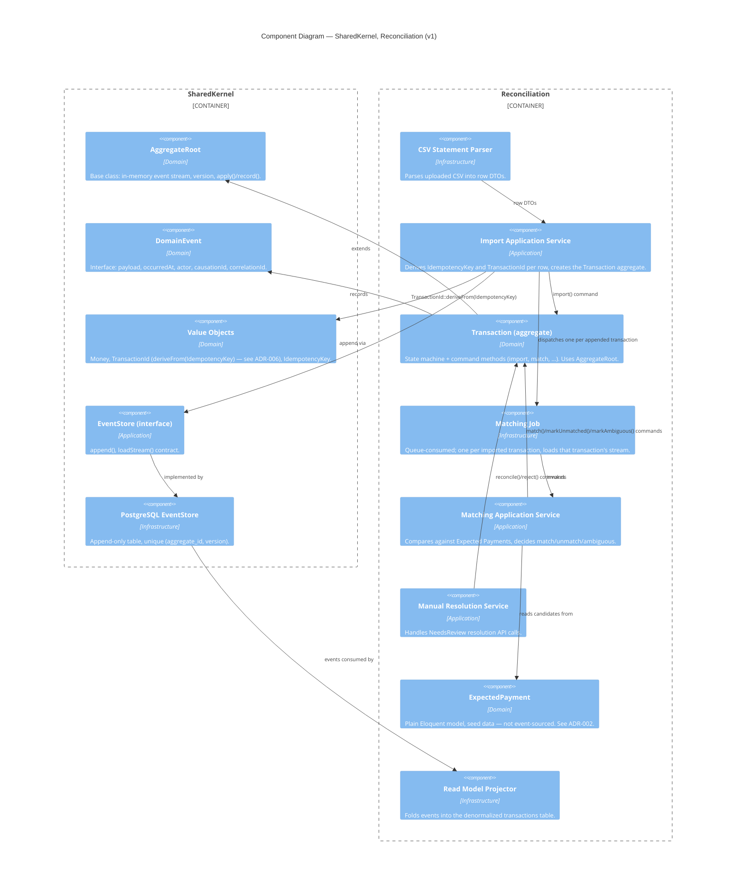

# C4 — Components (v1)

Internals of the two in-scope modules: `SharedKernel`, `Reconciliation`.
Each follows the same internal layering
(Domain / Application / Infrastructure — [PROJECT_CONTEXT.md](../../PROJECT_CONTEXT.md) §5).

## Notes

- `Transaction`, the import service, and the matching/review services all
  live inside the single `Reconciliation` module — they are Application
  Services within one bounded context, not separate modules. Every
  relationship above stays inside one `Container_Boundary`; there is no
  cross-module dependency-direction question to answer here (contrast with
  [ADR-001](../adr/ADR-001-modular-monolith.md), which covers *actual*
  cross-module boundaries such as `Reconciliation` → `Settlement`).
- `TransactionId` is derived deterministically from `IdempotencyKey`
  (UUIDv5), not randomly generated — see
  [ADR-006](../adr/ADR-006-deterministic-aggregate-id.md). This is what
  makes a duplicate or concurrent import collapse onto the same aggregate
  instead of racing to create two.
- `ExpectedPayment` is plain Eloquent, not event-sourced — see
  [ADR-002](../adr/ADR-002-hand-rolled-event-sourcing.md) for why only
  `Transaction` uses event sourcing.
- `Read Model Projector` is infrastructure, not domain: it has no business
  rules, only a fold from event to denormalized row.
