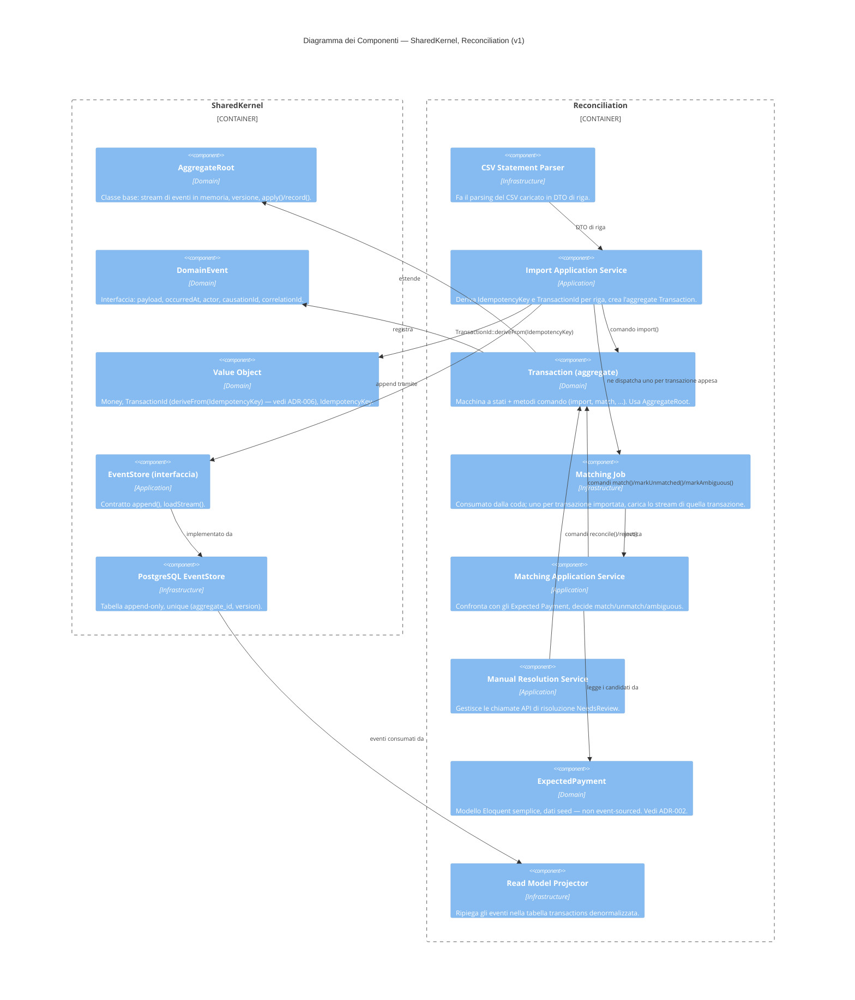

# C4 — Componenti (v1)

Interni dei due moduli in scope: `SharedKernel`, `Reconciliation`.
Ognuno segue lo stesso layering interno
(Domain / Application / Infrastructure — [PROJECT_CONTEXT_it.md](../../PROJECT_CONTEXT_it.md) §5).

## Note

- `Transaction`, il servizio di import e i servizi di matching/review
  vivono tutti dentro l'unico modulo `Reconciliation` — sono Application
  Service dello stesso bounded context, non moduli separati. Ogni
  relazione qui sopra resta dentro un unico `Container_Boundary`; non c'è
  alcuna domanda sulla direzione della dipendenza cross-modulo da porsi qui
  (a differenza di [ADR-001](../adr/ADR-001-modular-monolith_it.md), che
  copre confini cross-modulo *reali* come `Reconciliation` → `Settlement`).
- `TransactionId` è derivato in modo deterministico da `IdempotencyKey`
  (UUIDv5), non generato casualmente — vedi
  [ADR-006](../adr/ADR-006-deterministic-aggregate-id_it.md). È questo che
  fa collassare un import duplicato o concorrente sullo stesso aggregate
  invece di correre il rischio di crearne due.
- `ExpectedPayment` è Eloquent semplice, non event-sourced — vedi
  [ADR-002](../adr/ADR-002-hand-rolled-event-sourcing_it.md) per il perché
  solo `Transaction` usa l'event sourcing.
- `Read Model Projector` è infrastruttura, non dominio: non ha regole di
  business, solo un fold da evento a riga denormalizzata.
