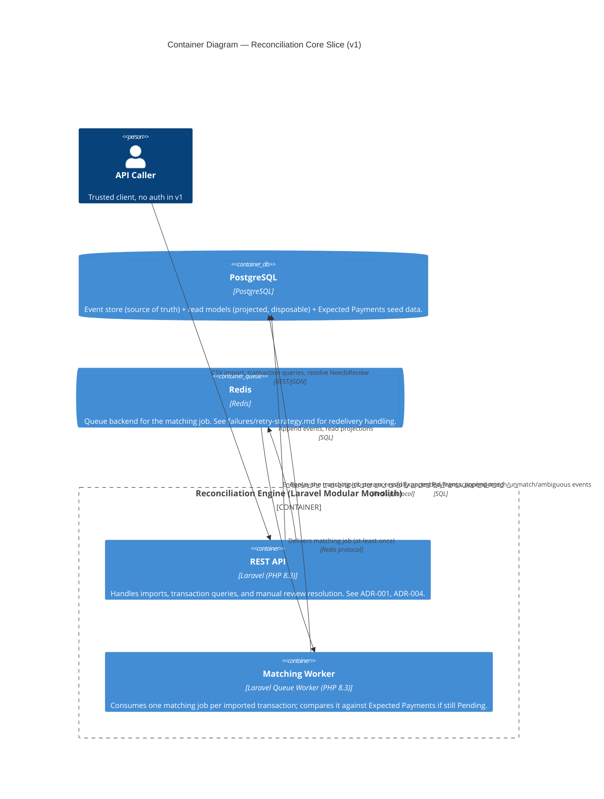

# C4 — Containers (v1)

The deployable/runtime units that make up the system.

## Notes

- **One PostgreSQL database**, not one per module — a deliberate consequence
  of the Modular Monolith decision ([ADR-001](../adr/ADR-001-modular-monolith.md)):
  module boundaries are enforced in code, not by separate schemas or
  databases, at this stage.
- **Redis is queue-only** in v1 — no cache layer designed yet; adding one
  later does not change this diagram's shape, just what Redis is used for.
- The matching worker is drawn as a distinct container from the API because
  it runs as an independent queue-worker process, even though its code lives
  in the same deployable/module (`Reconciliation`) — see [c4-component.md](c4-component.md)
  for where the job class lives.
- **One job per transaction, dispatched on import** — not a periodic sweep of
  the `Pending` table. The dispatch happens only after the
  `TransactionImported` append succeeds, so a duplicate import (which collides
  and no-ops, per [ADR-006](../adr/ADR-006-deterministic-aggregate-id.md))
  enqueues nothing.
- At-least-once delivery from the queue is why the matching job must be
  idempotent against transaction state — see
  [failures/retry-strategy.md](../failures/retry-strategy.md).
