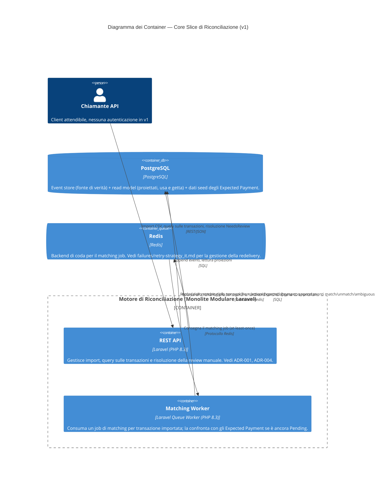

# C4 — Container (v1)

Le unità deployabili/di runtime che compongono il sistema.

## Note

- **Un solo database PostgreSQL**, non uno per modulo — conseguenza
  deliberata della decisione di Monolite Modulare
  ([ADR-001](../adr/ADR-001-modular-monolith_it.md)): i confini tra moduli
  sono imposti nel codice, non da schemi o database separati, in questa
  fase.
- **Redis è solo per la coda** in v1 — nessun layer di cache progettato
  ancora; aggiungerne uno in futuro non cambia la forma di questo diagramma,
  solo a cosa viene usato Redis.
- Il matching worker è disegnato come container distinto dall'API perché
  gira come processo di worker su coda indipendente, anche se il suo codice
  vive nello stesso deployable/modulo (`Reconciliation`) — vedi
  [c4-component_it.md](c4-component_it.md) per dove vive esattamente la
  classe del job.
- **Un job per transazione, dispatchato all'import** — non una scansione
  periodica della tabella dei `Pending`. Il dispatch avviene solo dopo che
  l'append di `TransactionImported` è andato a buon fine, quindi un import
  duplicato (che collide e fa no-op, per
  l'[ADR-006](../adr/ADR-006-deterministic-aggregate-id_it.md)) non accoda
  nulla.
- La consegna at-least-once dalla coda è il motivo per cui il matching job
  deve essere idempotente rispetto allo stato della transazione — vedi
  [failures/retry-strategy_it.md](../failures/retry-strategy_it.md).
