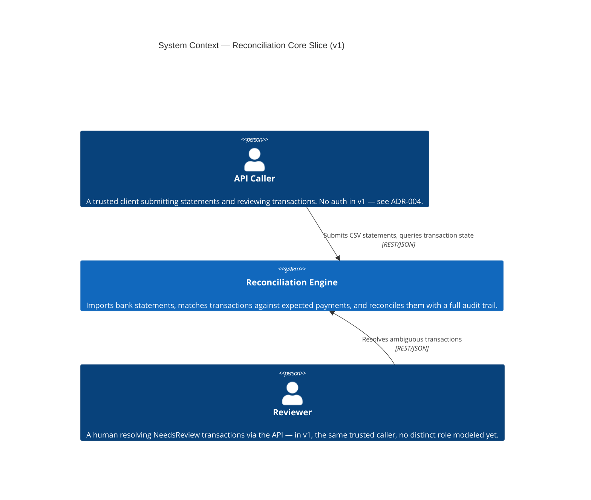

# C4 — System Context (v1)

Who and what interacts with the Financial Reconciliation Engine, at the
highest level of abstraction.

## Notes

- There is exactly one external actor type in v1: an API caller, assumed
  trusted (no authentication — [ADR-004](../adr/ADR-004-rest-api-only-no-admin-panel.md)).
  "Reviewer" is shown separately to reflect a distinct *role* in the domain
  (resolving `NeedsReview` cases), even though v1 does not model it as a
  distinct system actor with its own credentials.
- No PSP, bank, or PagoPA system appears as an external actor yet — v1
  ingestion is a CSV file submitted by the caller, not a live integration
  ([ADR-005](../adr/ADR-005-csv-only-ingestion-v1.md)). A real PSP/bank
  system would appear here as a new external actor when that integration is
  designed.
- No Settlement counterpart (e.g., a payout rail) appears — out of scope for
  v1 (core slice spec §2).
