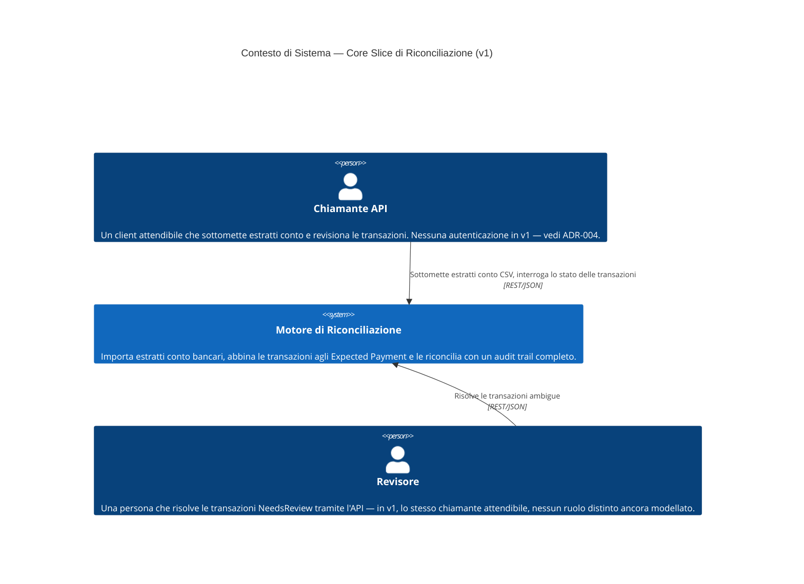

# C4 — Contesto di Sistema (v1)

Chi e cosa interagisce con il Motore di Riconciliazione Finanziaria, al
livello di astrazione più alto.

## Note

- C'è esattamente un tipo di attore esterno in v1: un chiamante API,
  assunto attendibile (nessuna autenticazione —
  [ADR-004](../adr/ADR-004-rest-api-only-no-admin-panel_it.md)).
  "Revisore" è mostrato separatamente per riflettere un *ruolo* distinto nel
  dominio (risolvere i casi `NeedsReview`), anche se la v1 non lo modella
  come un attore di sistema distinto con proprie credenziali.
- Nessun sistema PSP, banca o PagoPA compare come attore esterno per ora —
  l'ingestion v1 è un file CSV sottomesso dal chiamante, non
  un'integrazione live ([ADR-005](../adr/ADR-005-csv-only-ingestion-v1_it.md)).
  Un sistema PSP/banca reale comparirebbe qui come nuovo attore esterno
  quando quell'integrazione verrà progettata.
- Nessuna controparte di Settlement (es. un rail di payout) compare — fuori
  scope per la v1 (spec della core slice §2).
